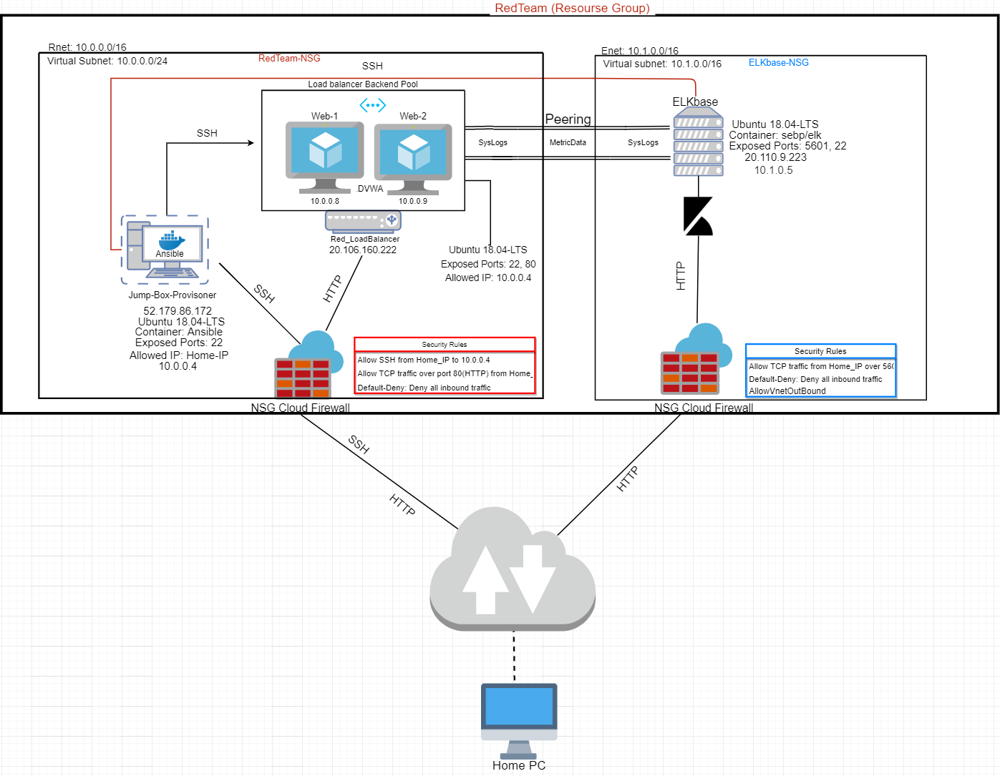
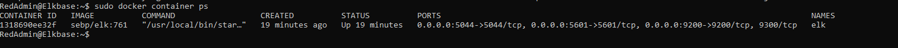

# ELK_Stack_Project
UPenn CyberSecurity Bootcamp ELK Stack Project

## Automated ELK Stack Deployment

The files in this repository were used to configure the network depicted below.

These files have been tested and used to generate a live ELK deployment on Azure. They can be used to either recreate the entire deployment pictured above. Alternatively, select portions of the playbook file may be used to install only certain pieces of it, such as Filebeat.

  - filebeat.yml

This document contains the following details:
- Description of the Topologu
- Access Policies
- ELK Configuration
  - Beats in Use
  - Machines Being Monitored
- How to Use the Ansible Build

### Description of the Topology

The main purpose of this network is to expose a load-balanced and monitored instance of DVWA, the D*mn Vulnerable Web Application.

Load balancing ensures that the application will be highly available, in addition to restricting access to the network.
- Load balancers help protect servers from cyber attacks such as a Distributed Denial-of-Service (DDoS) attack. By distributing traffic amongst the servers to lighten the load of traffic. One benefit of using a jump box is that it retricts access and protects your virtual machines from the internet.

Integrating an ELK server allows users to easily monitor the vulnerable VMs for changes to the log files and system metrics.
- File Logs monitoried by Filebeat
- Metrics monitoried by Metricbeat

The configuration details of each machine may be found below.
_Note: Use the [Markdown Table Generator](http://www.tablesgenerator.com/markdown_tables) to add/remove values from the table_.

| Name     | Function | IP Address | Operating System |
|----------|----------|------------|------------------|
| Jump Box | Gateway  | 10.0.0.4   | Linux            |
| Web-1    | VM       | 10.0.0.8   | Linux            |
| Web-2    | VM       | 10.0.0.9   | Linux            |
| ELKbase  | ELKStack | 10.1.0.5   | Linux            |

### Access Policies

The machines on the internal network are not exposed to the public Internet. 

Only the Jump Box machine can accept connections from the Internet. Access to this machine is only allowed from the following IP addresses:
- Home-IP

Machines within the network can only be accessed by SSH via the Jumpbox.
- 10.0.0.4

A summary of the access policies in place can be found in the table below.

| Name     | Publicly Accessible | Allowed IP Addresses |
|----------|---------------------|----------------------|
| Jump Box | No                  |  Home-IP             |
| DVWA-VMS | No                  |  10.0.0.4            |
| ELKbase  | No                  |  10.0.0.4 & Home-IP  |

### Elk Configuration

Ansible was used to automate configuration of the ELK machine. No configuration was performed manually, which is advantageous because...
- Ansible can ensure that provisioning scripts can be identically run between systems and users.

The playbook implements the following tasks:
- Installs Docker.io on the ELK machine
- Installs Python3-pip
- pip install docker module
- Uses sysctl to increase Virtual Memory
- Download and launch a docker elk container with exposed ports
- Enable Docker service on boot

The following screenshot displays the result of running `docker ps` after successfully configuring the ELK instance.

### Target Machines & Beats
This ELK server is configured to monitor the following machines:
- 10.0.0.8 (Web-1)
- 10.0.0.9 (Web-2)

We have installed the following Beats on these machines:
- Filebeat
- Metricbeat 

These Beats allow us to collect the following information from each machine:
- `Filebeat` collects log events, which we use to track and monitor user log messages.
- `Metricbeat` collects metric data, which we use to track user system health and status.

### Using the Playbook
In order to use the playbook, you will need to have an Ansible control node already configured. Assuming you have such a control node provisioned: 

SSH into the control node and follow the steps below:
- Copy the configuration files to the Ansible Container.
- Update the hosts file to include 10.0.0.8, 10.0.0.9
- Run the playbook, and navigate to Kibana (Public_IP:5601) to check that the installation worked as expected.

- Which file is the playbook? Where do you copy it?_

   The playbook file would be the YAML file that is provided. And it should be copied into the /etc/ansible directiory from the container.
   
- _Which file do you update to make Ansible run the playbook on a specific machine? How do I specify which machine to install the ELK server on versus which to install Filebeat on?

  You must update the hosts file in the etc/ansible directory by adding the ip address of the specific machine.
  
- Which URL do you navigate to in order to check that the ELK server is running?

  http://[your.VM.IP]:5601/app/kibana

